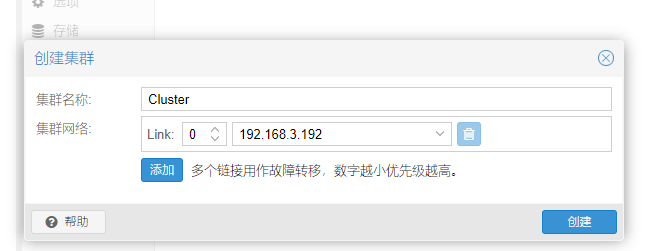

# 5.3 创建集群

您可以在控制台上创建集群(通过SSH登录)，也可以通过使用Proxmox VE Webinterface的API创建集群(数据中心→集群)。

**警告**

 - 请为您的集群使用唯一的名称。此名称以后无法更改。集群命名遵循与节点命名相同的规则。

## 5.3.1 通过网页界面创建集群

在“数据中心”→“集群”下，单击创建集群。输入集群名称，然后从下拉列表中选择一个网络连接作为主集群网络(Link 0)。它默认为通过节点的主机名解析的IP。



从Proxmox VE 6.2开始，可以为集群添加8条备用链路。要添加第二条链路作为备用链路，您可以选中Advanced复选框，然后选择一个额外的网络接口(Link 1，另见第5.8节[Corosync Redundancy](./Corosync_Redundancy.md))。

**警告**

- 确保为集群通信选择的网络未用于任何高流量负载，如(网络)存储或实时迁移。虽然集群网络本身只产生少量数据，但它对延迟非常敏感。详见第5.7.1节集群网络要求。

## 5.3.2 通过命令行创建集群

通过ssh登录到第一个Proxmox VE节点并运行以下命令：

```
hp1# pvecm create CLUSTERNAME
```

创建集群后，可以用如下命令查看集群状态：

```
hp1# pvecm status
```

## 5.3.3 同一网络内创建多个集群

可以在同一物理网络或逻辑网络内创建多个集群。每个集群必须使用不同的名字，这不仅有利于帮助管理员明确所操作的集群，也有利于避免集群通信故障。

尽管corosync集群通信占用的带宽并不高，但对网络数据包的延迟和每秒数据包吞吐量（PPS）有较高要求。而同一网络中的多个集群将互相争夺网络资源，所以在条件允许的情况下，还是尽量为大规模集群专门配置独立的物理网络设施。
          
