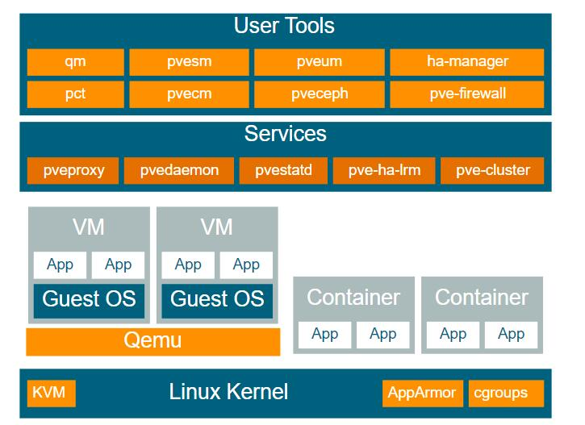

# Proxmox VE 安装需求

Proxmox VE 基于debian，主要有下面5个服务。

每个服务会因为worker的数量，占用不同的内存，在Proxmox VE默认安装之后，大概会占用1G左右的RAM。关于worker数量可以参考 [低内存优化](https://foxi.buduanwang.vip/virtualization/pve/1902.html/)

所以我们建议要安装Proxmox VE，请最少配置2G的内存。

我们整理了一个比较常见的配置，请供参考。

普通用户
- CPU： 双核
- 内存： 2G+
- 硬盘： 16G（仅用户装系统）
